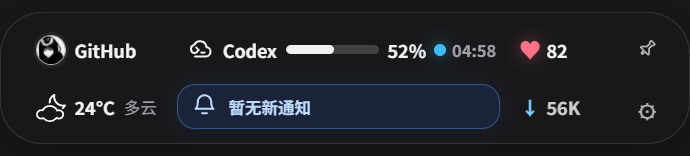

# WinPlate

WinPlate is a native status center for Windows and macOS, built with Electron
and a local FastAPI and SQLite backend.

<div align="center">

Windows 桌面悬浮状态板，聚合 GitHub、Codex、天气、通知、邮件与网络信息。

轻量常驻、信息集中、交互直接，适合把高频状态放回桌面可见区域。

</div>

<p align="center">
  
</p>

<p align="center">
  <strong>Electron</strong> + <strong>FastAPI</strong> + <strong>SQLite</strong>
</p>

## 项目简介

WinPlate 是一个面向 Windows 的悬浮状态面板。它将开发者日常最常看的几类信息收拢到一个紧凑的胶囊界面中，包括：

- GitHub 账号状态与贡献信息
- Codex 使用额度与重置时间
- 和风天气与位置选择
- 系统通知与智能通知摘要
- QQ 邮箱 IMAP 摘要
- 心率占位模块与网络速率显示

相比频繁切换网页、客户端和系统面板，WinPlate 更强调“抬眼即见”的桌面信息密度。

## 软件界面展示

上图展示的是 WinPlate 的悬浮主胶囊界面，整体布局分为三层：

- 左侧为 GitHub、Codex 等高频开发状态
- 中间为智能通知摘要区，突出当前最值得关注的信息
- 右侧为天气、心率、网络和设置入口等辅助信息

界面设计重点：

- 信息块足够紧凑，但仍保持清晰分组
- 核心数值使用强对比强调，适合桌面快速扫读
- 悬浮窗适合长期常驻，不会像完整应用窗口那样打断工作流

## 核心能力

### 1. GitHub 状态聚合

- 拉取公开 GitHub 资料、仓库信息与贡献日历
- 支持缓存与失败回退，避免 GitHub 接口偶发波动影响展示
- 可结合 Token 提升请求额度并启用官方 GraphQL 贡献数据

### 2. Codex 使用情况读取

- Electron 主进程独立启动隐藏 Codex CLI PTY
- 通过 `/status` 提取额度剩余百分比与重置时间
- 结果缓存 30 秒，避免频繁拉起命令造成干扰

### 3. 天气与位置管理

- 由本地 FastAPI 后端统一请求 QWeather
- 支持系统定位、手动城市选择与环境变量兜底
- 包含天气用量统计与预警通知同步逻辑

### 4. 智能通知摘要

- 聚合原始通知并按来源、优先级、风险变化做归类
- 对天气预警、GitHub 动态、开发任务状态做统一视图整理
- 支持未读数、批量已读、清空与测试通知注入

### 5. 邮件摘要与收件箱接入

- 支持 QQ 邮箱 IMAP 连接
- 提供邮件列表摘要、正文读取与已读同步
- 让邮件提醒进入同一个桌面信息面板

### 6. 桌面悬浮体验

- 独立浮窗显示，不必总停留在主应用页
- 主界面与悬浮态共享数据源
- 适合做常驻桌面开发状态总览

### 7. 模块化刷新与设置中心

- GitHub、Codex、邮件、通知、天气、心率和网络使用统一模块注册表
- 自动刷新按模块独立调度，失败时保留最后成功数据并显示降级状态
- 设置页支持模块启停、排序、刷新周期、界面密度、透明度和 AI 摘要开关
- GitHub Token 等密钥继续保存在 Windows 用户环境变量中，不会回显到渲染层

## 技术架构

```text
Electron Main
  |- 启动桌面窗口 / 托盘 / 悬浮窗
  |- 读取 Codex CLI 状态
  |- 管理系统交互与 IPC
  |
  |- FastAPI Backend (backend/local-api/winplate_local_api/main.py)
      |- GitHub 数据拉取
      |- QWeather 天气与预警
      |- QQ Mail IMAP 摘要
      |- SQLite 本地缓存与状态持久化
      |- 通知归档与聚合
  |
  |- Renderer
      |- Dashboard 主界面
      |- Floating 悬浮界面
      |- Settings / Mail / Notifications / QWeather 交互
```

## 快速开始

### 环境要求

- Windows
- Python 3.x
- Node.js

### 开发启动

### macOS

```sh
python3 -m venv .venv
.venv/bin/python -m pip install -r backend/local-api/requirements.txt
npm install
npm run dev
```

macOS starts one native menu bar item with an anchored panel and a native main
window. It never creates the desktop capsule.

### Windows (PowerShell)

```powershell
py -m venv .venv
.venv\Scripts\python.exe -m pip install -r backend/local-api/requirements.txt
npm install
npm run dev
```

Windows starts the 460 × 104 desktop capsule, Windows Tray, and frameless main
window.

Electron starts `winplate_local_api.main:api` from `backend/local-api`, waits for
`http://127.0.0.1:8765/api/health`, then creates the platform-specific shell. The renderer refreshes
`GET /api/status` every 30 seconds.

启动流程如下：

1. Electron 拉起本地 Python 后端 `backend/local-api/winplate_local_api/main.py`
2. 等待 `http://127.0.0.1:8765/api/health` 返回正常
3. 创建主窗口与悬浮窗口
4. 渲染层按模块刷新；默认 Codex 30 秒、通知 60 秒、网络 2 秒，其余周期由设置中心管理

The setup scripts use `scripts/venvPython.js` to resolve `.venv/bin/python` on
macOS and `.venv\Scripts\python.exe` on Windows. Electron uses those same
platform paths when it starts the backend, so the virtual environment does not
need to be activated before `npm run dev`. Set `WINPLATE_PYTHON` to an explicit
interpreter path to override Electron's automatic resolution.

如需手动激活：

```powershell
.\.venv\Scripts\Activate.ps1
```

## 常用脚本

```powershell
npm run dev
npm run check
npm run backend:test
```

说明：

- `npm run dev`：启动 Electron 开发环境
- `npm run check`：执行主进程、渲染层语法检查与 Node 测试
- `npm run backend:test`：运行后端 Python 单元测试

## 配置说明

### GitHub

默认 GitHub 账号为 `kibuouo`。如需切换：

```powershell
$env:WINPLATE_GITHUB_USERNAME = "your-login"
$env:GITHUB_TOKEN = "github_pat_..."
npm run dev
```

说明：

- `WINPLATE_GITHUB_USERNAME`：指定展示的 GitHub 用户
- `GITHUB_TOKEN`：可选，但推荐配置，用于提升速率限制并启用 GraphQL 贡献数据

### QWeather

## Platform and settings

On macOS, Settings exposes `menuBarEnabled` and `launchAtLogin`.
`menuBarEnabled` creates or removes the native menu bar item and panel;
`launchAtLogin` controls whether WinPlate starts when you sign in. The Dock icon
and native main window remain reachable even when the menu bar item is disabled.

QWeather and DeepSeek are configured in the main window's Settings page on both
platforms. Public fields are stored under Electron's `userData` directory.
QWeather API keys/private keys and the DeepSeek API key are encrypted with
Electron `safeStorage`. User-entered secrets exist in the renderer form and
cross the narrow preload IPC boundary when saved. Persisted secret values are
never returned to the renderer; settings reads expose only public values and
configured flags. API requests use secrets only in privileged processes: the
Electron main process or the local Python backend.

Process environment variables are advanced overrides and take precedence over
stored values on both platforms. The exact supported overrides are
`QWEATHER_API_KEY`, `QWEATHER_API_HOST`, `QWEATHER_PROJECT_ID`,
`QWEATHER_CREDENTIAL_ID`, `QWEATHER_PRIVATE_KEY`, `DEEPSEEK_API_KEY`, and
`DEEPSEEK_BASE_URL`.

For compatibility on Windows, the first startup with no encrypted settings file
imports legacy values from `HKCU\Environment` into encrypted storage
automatically. After a successful import, the registry is no longer read. If the
encrypted import fails, the legacy values remain the current-session fallback
and the import is retried later. WinPlate does not write new registry values.

Restart WinPlate after changing QWeather credentials because the Python backend
receives its environment at startup. A saved DeepSeek change may be used
immediately by the Electron main-process request path, but restart if a result
still reflects an earlier configuration.

## QWeather

Weather data is loaded by the Python backend and cached for ten minutes. Create a
project and API key in the [QWeather console](https://console.qweather.com/),
then open WinPlate's main window and enter its API Key and assigned API Host in
Settings. Project ID, Credential ID, and an Ed25519 private key are optional and
enable official usage statistics.

For automation or temporary overrides, set process environment variables before
starting WinPlate. For example, in PowerShell:

```powershell
$env:QWEATHER_API_KEY = "your-api-key"
$env:QWEATHER_API_HOST = "your-project-api-host"
npm run dev
```

WinPlate requests system location permission and sends only the resulting
coordinates to the local backend. `QWEATHER_LOCATION` is an optional process
environment fallback when system location is unavailable; it accepts a city
name or location ID. There is no default fallback location. The QWeather API key
crosses the preload IPC boundary when the form is saved, but persisted settings
reads return only its configured flag. Electron injects the effective key into
the local Python backend at startup, where QWeather API requests are made.

## DeepSeek

Open the main window's Settings page and enter the DeepSeek API Key and Base URL
(the default is `https://api.deepseek.com`). The key crosses the preload IPC
boundary when the form is saved, but persisted settings reads return only its
configured flag. DeepSeek API requests are made by the privileged Electron main
process, never by renderer code. Advanced users can override the saved values for
a launch with `DEEPSEEK_API_KEY` and `DEEPSEEK_BASE_URL` in the process
environment.

## Verification

Run the same Node and Python suites used by CI:

```sh
npm run check
npm run backend:test
git diff --check
```

GitHub Actions runs both suites on `macos-latest` and `windows-latest` with
Node.js 22 and Python 3.12.

补充说明：

- `QWEATHER_LOCATION` 可作为系统定位失败时的后备位置
- 如果未授权定位且未配置后备位置，界面会提示手动设置城市
- API Key 保留在本地后端，不会暴露到渲染层

Packaging remains future work and is out of scope for the current development
build. The backend is intentionally isolated behind `apps/windows-electron/src/main/pythonService.js`.

### Python 解释器覆盖

如果你不想使用默认 `.venv`，可以显式指定解释器：

```powershell
$env:WINPLATE_PYTHON = "C:\path\to\python.exe"
npm run dev
```

## 项目结构

```text
winPlate/
|- apps/windows-electron/ Electron 应用源码与平台资源
|- backend/       FastAPI、天气、GitHub、邮件、SQLite
|- docs/          模块开发与维护说明
```

新增模块请参阅 [`docs/adding-module.md`](./docs/adding-module.md)。

## 当前定位

这个项目更像一个“桌面开发状态中枢”，而不只是一个天气或 GitHub 小组件。它把多来源信息压缩到同一个稳定、轻量、低打扰的桌面入口中。

适合的使用场景：

- 一边开发一边关注 GitHub / Codex / 邮件变化
- 想在桌面常驻看到天气与网络速率
- 希望把通知整合成更有优先级的摘要，而不是散落在多个应用里

## 打包方向

后端已经通过 `apps/windows-electron/src/main/pythonService.js` 与 Electron 主进程解耦，后续可以打包为单文件可执行程序：

```powershell
python -m pip install pyinstaller
pyinstaller --onefile --name winplate-backend backend/local-api/winplate_local_api/main.py
```

后续只需将生成的后端可执行文件作为 Electron 资源一并打包，并在生产模式切换启动入口即可。

## 版本

当前项目版本：`v0.1.0`
