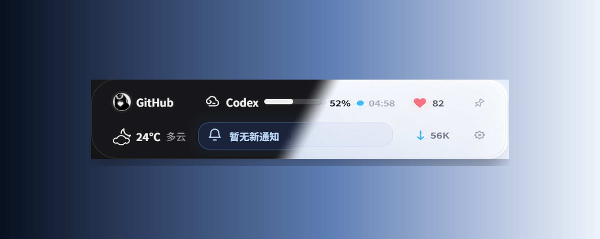
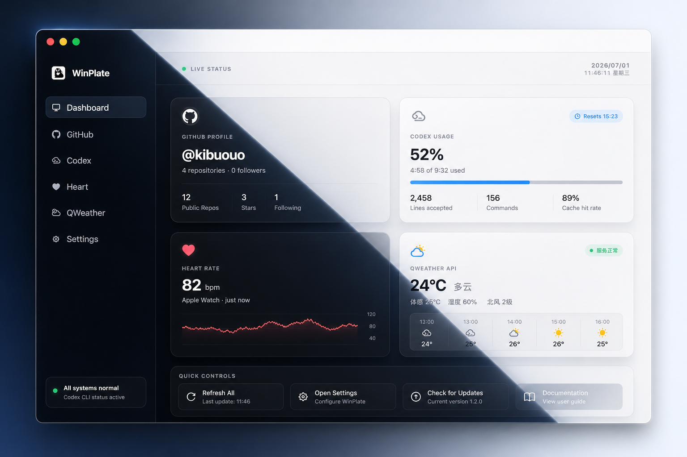

# WinPlate

WinPlate 是一个面向 Windows 和 macOS 的本地优先状态中心，把 GitHub、Codex、天气、通知、邮件、网络等高频信息压缩进桌面胶囊和主界面里，让开发过程里的关键状态始终留在视线范围内。

<p align="center">
  
</p>

<p align="center">
  <strong>Electron</strong> + <strong>FastAPI</strong> + <strong>SQLite</strong> + <strong>safeStorage</strong>
</p>

## 主界面展示

WinPlate 提供两类核心界面：

- 胶囊态：常驻桌面，负责“抬眼即见”的即时状态。
- 主界面：承载 Dashboard、设置页、模块详情和服务配置。

### 胶囊态预览

上图是基于两张现有胶囊图融合得到的 WinPlate 胶囊主题展示：同一枚胶囊里通过一条斜向分界同时呈现深色与浅色主题，同时保留原始布局不变。它把 GitHub、Codex、通知、天气、心率和网络压缩在一个圆角浮层里，适合长期悬浮而不打断工作流。

### 主界面主题融合展示

<p align="center">
  
</p>

这张图展示的是 WinPlate 主界面的斜向主题融合效果：在同一个完整窗口里同时呈现深色与浅色主题，并保持侧边栏、状态卡片和设置区域属于同一套连续布局。Windows 与 macOS 使用同一套渲染层主题变量，差异主要在平台壳层和窗口策略上。

## 深色 / 浅色双 CSS 主题

WinPlate 的主题不是两套分裂页面，而是一套 DOM 结构配合两层主题变量：

- 胶囊态主题：定义在 `apps/windows-electron/src/renderer/styles.css` 的 `.status-capsule` 和 `html[data-theme="light"] .status-capsule`。
- 主界面主题：定义在同一个文件里的 `.main-body` 和 `html[data-theme="light"] .main-body`。
- 运行时切换：由 `apps/windows-electron/src/renderer/app.js` 写入 `document.documentElement.dataset.theme`，同步驱动胶囊态和主界面。

### 胶囊态主题变量

```css
.status-capsule {
  --capsule-surface: rgba(24, 24, 27, .92);
  --capsule-text: #f4f4f5;
  --capsule-border: rgba(255, 255, 255, .12);
  --capsule-shadow: 0 16px 40px rgba(0, 0, 0, .28);
}

html[data-theme="light"] .status-capsule {
  --capsule-surface: rgba(250, 250, 252, .94);
  --capsule-text: #18181b;
  --capsule-border: rgba(24, 24, 27, .14);
  --capsule-shadow: 0 16px 38px rgba(15, 23, 42, .18);
}
```

### 主界面主题变量

```css
.main-body {
  --main-bg: #202123;
  --surface-card: #26272a;
  --text: #f4f4f5;
  --text-muted: #8e8ea0;
}

html[data-theme="light"] .main-body {
  --main-bg: #ffffff;
  --surface-card: #ffffff;
  --text: #202123;
  --text-muted: #8e8ea0;
}
```

### 主题切换入口

```js
const theme = resolvedTheme();
document.documentElement.dataset.theme = theme;
document.documentElement.style.colorScheme = theme;
```

这套做法的好处是明确：

- 胶囊态和主界面共享主题状态，不会出现一边深色一边浅色的割裂。
- 主题差异集中在 token 层，模块结构本身无需复制。
- 后续新增模块时，只要遵循现有变量体系，就能自然获得深浅色适配。

## 关键能力

- 桌面胶囊：在 460 × 104 的浮层里聚合开发者最常看的实时状态。
- Dashboard 主界面：提供更完整的模块卡片、详情页、设置页和服务状态。
- 模块化刷新：GitHub、Codex、天气、通知、邮件、心率、网络都走独立模块注册和刷新节奏。
- 本地优先安全边界：敏感配置保留在 Electron 主进程或本地 Python 后端，渲染层只拿展示所需数据。
- 平台分层：Windows Electron、macOS Electron Menu Bar、共享包和本地 API 都有清晰边界。

## 关键技术

- `Electron`：负责桌面窗口、托盘、平台壳层、IPC 与系统能力接入。
- `FastAPI`：承接本地 API、天气请求、GitHub 聚合、邮件接入和通知数据整理。
- `SQLite`：承载本地缓存、通知归档和状态持久化。
- `Electron safeStorage`：加密保存 GitHub Token、DeepSeek Key、QWeather 私钥、QQ 邮箱授权码等敏感信息。
- `Monorepo Workspaces`：通过 npm workspaces 管理 Windows、macOS、共享包和验证脚本。
- `Loopback-only local API`：后端仅绑定 `127.0.0.1:8765`，不暴露到局域网。

## 项目结构

```text
winPlate/
|- apps/
|  |- windows-electron/        Windows 桌面胶囊与主界面
|  |- macos/electron-menubar/  macOS 菜单栏与主界面壳层
|  |- ios/                     平台边界说明
|  `- watchos/                 平台边界说明
|- backend/
|  `- local-api/               FastAPI、本地服务、SQLite、测试
|- packages/
|  |- core/                    共享业务规则与模块模型
|  |- shared-types/            JSON Schema 与共享契约
|  `- icons/                   图标映射与语义图标
|- docs/                       架构、路线图、验证记录
|- scripts/                    venv、布局和仓库校验脚本
|- package.json                workspace 入口脚本
`- README.md
```

如果要新增模块，建议先看 [`docs/adding-module.md`](./docs/adding-module.md) 和 [`docs/architecture.md`](./docs/architecture.md)。

## 架构说明

```text
apps/windows-electron ─┐
apps/macos/* ──────────┼─> packages/core + shared-types + icons
                       └─> backend/local-api (127.0.0.1:8765 only)
```

职责划分如下：

- `apps/`：平台生命周期、窗口、托盘、菜单栏和渲染壳层。
- `packages/`：跨平台共享规则，不直接依赖 Electron、FastAPI 或 SQLite。
- `backend/local-api/`：网络请求、邮件、天气、GitHub、通知、缓存与持久化。

## 快速开始

### 环境要求

- Node.js 22+
- Python 3.12+
- Windows 或 macOS

### Windows

```powershell
py -m venv .venv
.venv\Scripts\python.exe -m pip install -r backend/local-api/requirements.txt
npm install
npm run dev
```

### macOS

```sh
python3 -m venv .venv
.venv/bin/python -m pip install -r backend/local-api/requirements.txt
npm install
npm run dev
```

Electron 会自动拉起本地后端，等待 `http://127.0.0.1:8765/api/health` 就绪后再创建平台窗口。

## 常用脚本

```powershell
npm run dev
npm run check
npm run backend:test
```

- `npm run dev`：启动桌面应用开发环境。
- `npm run check`：运行 Node 语法检查和测试。
- `npm run backend:test`：运行 Python 后端测试。

## 配置与安全

- GitHub、DeepSeek、QWeather、QQ 邮箱等服务配置统一在主界面的 Settings 页保存。
- GitHub Token、DeepSeek Key、QWeather 私钥与 QQ 邮箱授权码都走本地加密存储，不会回显到渲染层。
- 进程环境变量仍可作为高级覆盖项使用，例如 `GITHUB_TOKEN`、`DEEPSEEK_API_KEY`、`QWEATHER_API_KEY`、`QQ_MAIL_AUTH_CODE`。
- 保存 QWeather、GitHub、QQ 邮箱等后端依赖配置后，WinPlate 会自动重启本地 Python 后端以应用新配置。

## 验证

```sh
npm run check
npm run backend:test
git diff --check
```

更多背景可以继续看：

- [仓库架构](./docs/architecture.md)
- [通知中心契约](./docs/notification-center.md)
- [平台路线图](./docs/platform-roadmap.md)
